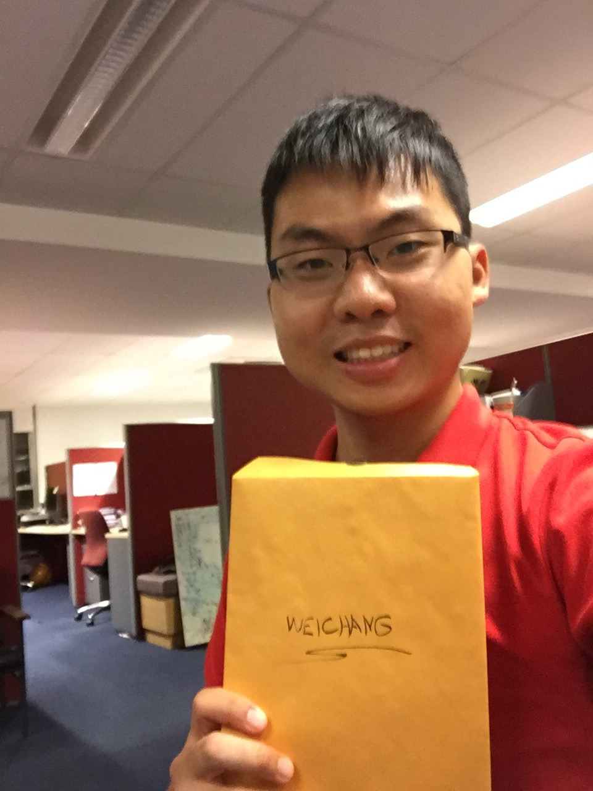
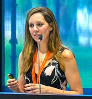

# VaDA

Variational discriminant analysis with variable selection.

* * *

# About this package

Variational discrimination analysis (VaDA) is a family of three Bayesian discriminant analysis models that performs within-model selection of discriminative variables and classification of testing data. The first model, variational linear discriminant analysis (VLDA), assumes that variables have equal group-specific variances whereas the second model, variational quadratic discriminant analysis (VQDA), allows the group-specific variances to differ. The latest addition to this package is the variational nonparametric discriminant analysis that treats the conditional distribution of the variables as random and assigns a Polya tree prior to it. The required posterior distributions are approximated with collapsed variational Bayes - a fast, deterministic and reasonably accurate alternative to MCMC. 

This package contains all tools required to run VaDA on R. The codes have been written in C++ to achieve good computational speed (5-fold CV for a 109 x 15681 dataset ~ 25ms for VLDA and VQDA; 40s for VNPDA).

* * *

# Pre-installation instructions (Mac Users Only)
Please skip this step if you are not a Mac user. The package requires a Fortran compiler (through its RcppArmadillo dependency).
Chances are, your current Fortran compiler is not up-to-date. To update your Fortran compiler, simply follow the steps here: <br />
&nbsp;

1. In your Mac App Store, search "Xcode" and install. <br />
2. Open Terminal application. Type in

```{eval=FALSE}
xcode-select install
```
&nbsp; &nbsp;&nbsp;
and follow the instructions.<br />
&nbsp; &nbsp;&nbsp;
3. Click on the link [here](https://github.com/fxcoudert/gfortran-for-macOS/releases). Download the gfortan dmg file according to your MacOS version. <br />
&nbsp; &nbsp;&nbsp;
4. Open the dmg file, run the gfortran installer, follow all the instructions.

* * *

# Installation
```{r}
# Install the development version from GitHub:
# install.packages("devtools")
devtools::install_github("weichangyu10/VaDA")
```

* * *

# Toy example
```{r}
library(VaDA)
data(LIHCtoy)
# Labels read into y
y <- y
# Variables read into X
X <- as.matrix(X)
# Training the two VaDA classifiers
#Parameters used: (labels for training data, variables for training data, variables for testing data)
resVLDA <- VLDA(y,X,X,r=0.98,kappa=(1/7))
resVQDA <- VQDA(y,X,X,r=0.98,kappa=(1/7))
#using c=1 for VNPDA
p<-dim(X)[2]
resVNPDA <- VNPDA(X,y,X,rep(1,p),1,1,1,p,maxdepth=6)
# VLDA resubstitution error
mean(y!=resVLDA$y.hat)
# VQDA resubstitution error
mean(y!=resVQDA$y.hat)
# VNPDA resubstitution error
mean(y!=resVNPDA$ClassPred)
# Counting the number of discriminative genes (omega > 0.5) selected by VLDA
sum(resVLDA$omega>0.5)
# Counting the number of discriminative genes (omega > 0.5) selected by VQDA
sum(resVQDA$omega>0.5)
# Counting the number of discriminative genes (omega > 0.5) selected by VNPDA
sum(resVNPDA$omega>0.5)
```

* * *

# Authors
<p align="left">
  
  
  
  
  <figcaption> &nbsp; &nbsp; &nbsp; Weichang Yu &nbsp; &nbsp; &nbsp; &nbsp; &nbsp; John Ormerod   &nbsp; &nbsp; &nbsp; &nbsp; &nbsp; Michael Stewart  &nbsp; &nbsp; &nbsp;&nbsp; &nbsp; &nbsp; Lamiae Azizi</figcaption>
</p>

<meta name="google-site-verification" content="W0k3rB7nJmCwsyaGKShsiAHywGJ6Vz5hlqYxI3UKsrA" />

* * *

# Bibliography
1. Yu, W., Ormerod, J.T., Stewart, M., 2018. Variational discriminant analysis with variable selection. [ArXiV link](https://arxiv.org/abs/1812.06605). <br />
2. Yu, W., Azizi, L., Ormerod, J.T., 2018. Variational nonparametric discriminant analysis. [ArXiV link](https://arxiv.org/abs/1812.03648). <br />
